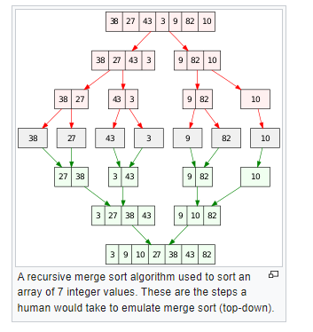

### Conclusions 
1. Number of swaps in bubble sort is the sum of swaps for each elem in array. Nr. of
swaps for each elem is the number of lesser elements on the right side of the elem, e.g.:
```
array=[4,2,1,5,3,6,8,3]
nos = nos4 + nos2 + nos1 + nos5 + nos3 + nos6 + nos8 + nos3
nos =  4   +  1   +  0   +  2   +  0   +  1   +  1   +  0   = 9
where nos- nr of. swaps
```
2. You need to know all sorting algorithms. Merge sort algorithm is not that hard, 
actually its all about splitting array in half up to the point the `len(arr)==1`,
then you just need to merge the halfs, in asceding order.
3. Number of swaps in merge sort is the sum of numbers of unused numbers 
in left arr in case current value in left arr is greater than current number in 
right arr, e.g.
```python
left = [4,5,10]
right = [6,8,9]
```
In above example number of inversions will be:
```inv_cnt = inv_6 + inv_8 + inv_9 = 1 + 1 + 1 = 3```, cause for number `10` in left
arr we have `6`, `8`, `9` that are lesser that it and only 1 unused value 
in left arr (which is `10`) 
4. Visualization of merge sort:


### Links
1. https://stackoverflow.com/questions/20035505/bubble-sort-number-of-swaps
2. https://en.wikipedia.org/wiki/Merge_sort#Analysis
3. https://www.geeksforgeeks.org/in-place-merge-sort/
4. https://www.geeksforgeeks.org/python-program-for-merge-sort/
