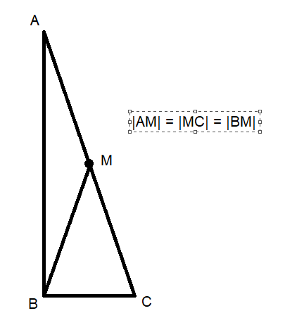

### Conclusions 
1. In 90 degree triangle the midpoint of hypotenuse creates segment which length 
is half of hypotenuse: 

2. Use arcus sinus for calculating angle value in radius
3. Calculate arc value from radians to degrees by multiplying by 180 / pi

### Links
1. https://www.geeksforgeeks.org/degrees-and-radians-in-python/
2. https://www.w3schools.com/python/ref_math_asin.asp
